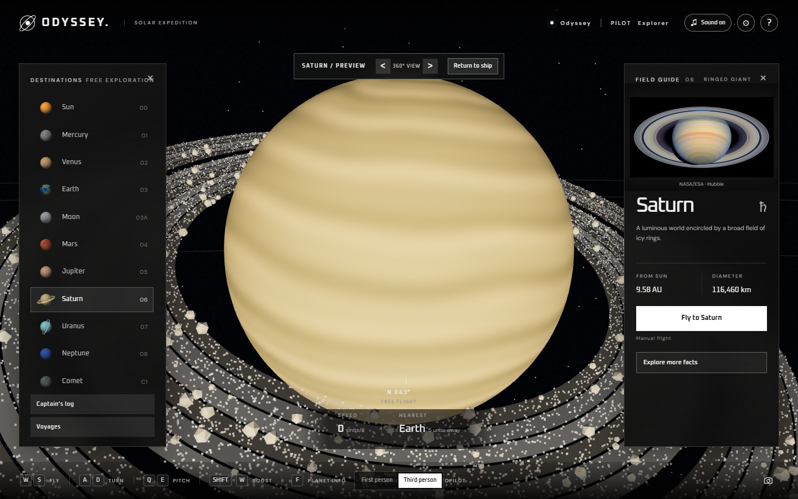

# Odyssey — Solar System Explorer

A first-person and third-person space exploration prototype built for the browser with Three.js. Odyssey combines free flight, guided discovery, and an interactive field guide to make exploring the solar system feel like a journey.

*Saturn in Exploration mode, with the destination list and Field Guide open.*

## Highlights

- Explore the Sun, planets, Earth's Moon, and a comet through free flight or autopilot.
- Choose **Discovery** to scan and reveal 11 destinations, or **Exploration** to browse them freely.
- Read NASA-sourced facts and credited imagery in each world's Field Guide.
- Record flybys, scans, and encounters in the Captain's log, with a photo gallery for flight snapshots.
- Follow optional Voyages and scan landmarks such as Olympus Mons, the Great Red Spot, and the Cassini Division.
- Customize a ship and pilot, with original music and responsive engine and collision audio.
- Use reduced motion settings for more immediate camera changes.

## Built with

Three.js, JavaScript, Vite, and browser storage. The 3D scene includes animated planets, Saturn's particle rings, an asteroid belt, ship effects, and a comet. Progress and photos are saved in the browser for each game mode.

## Design notes

Odyssey favors readable navigation over astronomical scale: planets are enlarged and orbital distances compressed. Its Field Guide uses credited NASA imagery and source links. The three continuous music scores and flight sound effects were created for the project.

This is an interactive prototype, not a scientific simulator. Flight progress is local to the browser and does not sync between devices.
